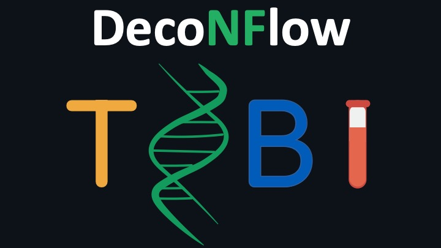

# Table of Contents
1. [Introduction](#Introduction)
2. [Usage](#Usage)
3. [Credits](#Credits)
4. [License](#License)
5. [Citations](#Citations)

# Introduction
DNAmDeconv is a bioinformatics analysis pipeline used for computational deconvolution of DNA methylation data. It allows deconvolution of samples using both reference-based and reference-free deconvolution tools. It also allows benchmarking of the different tools included in the pipeline.

The pipeline is built using [Nextflow](https://www.nextflow.io/) a workflow tool to run tasks across multiple compute infrastructures in a very portable manner. It uses Docker / Singularity containers making installation trivial and results highly reproducible.

# Pipeline Summary
The pipeline allows you to run both reference-based and reference-free deconvolution tools. Visit docs for more information.

| Reference-based deconvolution tools |
|-------------------------------------|
| meth_atlas (default) |
| CIBERSORT            |
| EpiDISH              |
| MethylResolver       |
| EpiSCORE             |
| PRMeth               | 
| CelFiE               |

| Reference-free deconvolution tools |
|-------------------------------------|
| MeDeCom              |
| PRMeth (default)     |

# Usage
> **NOTE**
If you are new to Nextflow and nf-core, please refer to [this page](https://nf-co.re/docs/usage/getting_started/installation) on how to set-up Nextflow.

## Testing samples
First, prepare a samplesheet (.csv) file with your samples that need to be deconvolved as follows:

`test.csv`:
```plaintext:
name,sample
test1,/path/to/the/files/file1.cov.gz
test2,/path/to/the/files/file2.cov.gz
test3,/path/to/the/files/file3.cov.gz
test4,/path/to/the/files/file4.cov.gz
```
Each row represents a sample, defined by a name (first column) and the sample path to the coverage file (second column).

## Region file
> **NOTE** The chromosome must be consistent among coverage and region files. Always use the same format (in the example below the chromosome name is represent just by the number, without the "chr" string).

Second, prepare a .tsv or .bed file that includes the pre-defined regions according to which the single CpGs in the coverage files will be clustered. The file looks as follow:

`regions.bed`
```plaintext:
1   10497       10588
1   10589       10640
1   10641       10669
... ...         ...
22  50064015    50064037
22  50064064    50064084
22  50064090    50064112
```
Each row represents a region, defined by chromosome (first column), starting position (second column) and ending position (third column). 

## Reference dataset
> **NOTE** This step can be skipped if no reference samples are available, or if you want to run reference-free deconvolution tools.

Finally, prepare a samplesheet with your reference samples to build the reference matrix. This step is necessary if you want to use reference-based deconvolution tools. The file looks as follows:

`reference.csv`
```plaintext:
name,type,file
file1,healthy,/path/to/the/file/file1.cov.gz
file2,healthy,/path/to/the/file/file2.cov.gz
file3,healthy,/path/to/the/file/file3.cov.gz
file4,nbl,/path/to/the/file/file4.cov.gz
file5,nbl,/path/to/the/file/file5.cov.gz
file6,nbl,/path/to/the/file/file6.cov.gz
```
Each row represents a coverage file, with the first column representing the sample name, the second column representing the name of the cell type and the last column representing the path where the coverage file is stored.

## Run the pipeline
Now you can run the NextFlow (>=23.10.1) pipeline. If in the params.yaml you specify the input file (`--input`) but no tools, the pipeline will automatically deconvolve the samples using meth_atlas.

Alternatively, if you do not specify the input file, the pipeline will automatically run the reference-free deconvolution workflow and deconvolve the samples using PRMeth (with reference-free modality).

If you want to run the pipeline with one tool which is not the default one, you just have to specify the corresponding flag (e.g. `--cibersort`). The pipeline can also be run using the flag `--benchmark`. In this case, it will run all the tools included in the pipeline, and for this reason the `--input` argument is required.

You can run the pipeline using docker profile:
```plaintext:
nextflow run main.nf -params-file params.yaml -profile docker
```
Or using singularity profile:
```plaintext:
nextflow run main.nf -params-file params.yaml -profile singularity
```
The params.yaml file looks like the following:

`params.yaml`:
```plaintext: 
input: ./resources/reference.csv
output_dir: ./results
regions_file: ./resources/RRBS_regions20-200.bed
test_samples: ./resources/test.csv
```
All the parameters specified in the file can also be specified in the command line using the corresponding flags.

# Credits
The scripts and containers have been written and built by Edoardo Giuili ([@edogiuili](https://github.com/edogiuili)), Maísa Santos([@mferrodo](https://github.com/mferrodo)) and Sofie Van de Velde ([@sofie](https://github.com/sofvdvel)), who are also the maintainers.

# Citations
If you use this pipeline for your analysis, please cite it using the following doi: (...).
You can cite the nf-core publication as follows:
> The nf-core framework for community-curated bioinformatics pipelines. 
>
> Philip Ewels, Alexander Peltzer, Sven Fillinger, Harshil Patel, Johannes Alneberg, Andreas Wilm, Maxime Ulysse Garcia, Paolo Di Tommaso & Sven Nahnsen.
>
> Nat Biotechnol. 2020 Feb 13. doi: [10.1038/s41587-020-0439-x](https://www.nature.com/articles/s41587-020-0439-x).